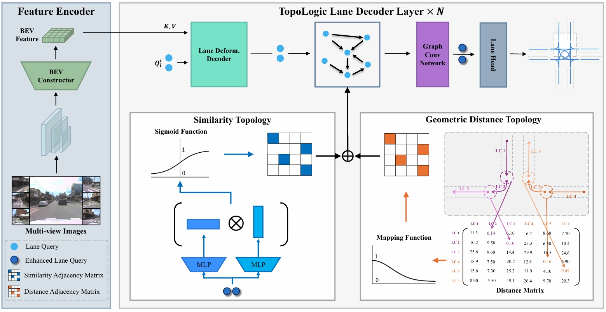

<div align="center">

# TopoLogic: An Interpretable Pipeline for Lane Topology Reasoning on Driving Scenes


[](https://arxiv.org/abs/2405.14747)
[](https://github.com/OpenDriveLab/OpenLane-V2)
[](./LICENSE)




</div>

> - Production from [Institute of Computing Technology, Chinese Academy of Sciences](http://www.ict.ac.cn/). 
> - Primary contact: [Yanping Fu](https://scholar.google.cz/citations?user=qo7La8cAAAAJ&hl=zh-CN&oi=sra) ( fuyanping23s@ict.ac.com ) or/and [Xinyuan Liu](https://scholar.google.cz/citations?user=eXwizz8AAAAJ&hl=zh-CN&oi=sra).

---

This repository contains the source code of **TopoLogic**, [An Interpretable Pipeline for Lane Topology Reasoning on Driving Scenes](https://arxiv.org/abs/2405.14747).

TopoLogic is the first to employ an interpretable approach for lane topology reasoning. TopoLogic fuses **the geometric distance of lane line endpoints** mapped through a designed function and **the similarity of lane query in a high-dimensional semantic space** to reason lane topology. Experiments on the large-scale autonomous driving dataset OpenLane-V2 benchmark demonstrate that TopoLogic significantly outperforms existing methods in topology reasoning in complex scenarios.

## Table of Contents
- [TopoLogic: An Interpretable Pipeline for Lane Topology Reasoning on Driving Scenes](#topologic-an-interpretable-pipeline-for-lane-topology-reasoning-on-driving-scenes)
  - [Table of Contents](#table-of-contents)
  - [Main Results](#main-results)
    - [Results on OpenLane-V2 subset-A val](#results-on-openlane-v2-subset-a-val)
    - [Results on OpenLane-V2 subset-B val](#results-on-openlane-v2-subset-b-val)
  - [Prerequisites](#prerequisites)
  - [Installation](#installation)
  - [Prepare Dataset](#prepare-dataset)
  - [Train and Evaluate](#train-and-evaluate)
    - [Train](#train)
    - [Evaluate](#evaluate)
    - [](#)
  - [License](#license)
  - [Citation](#citation)
  - [Related resources](#related-resources)


## Main Results

### Results on OpenLane-V2 subset-A val

We provide results on **[Openlane-V2](https://github.com/OpenDriveLab/OpenLane-V2) subset-A val** set.

|    Method    | Backbone | Epoch |SDMap | DET<sub>l</sub> | TOP<sub>ll</sub> | DET<sub>t</sub> | TOP<sub>lt</sub> |   OLS    |
| :----------: |----| :-------: | :---: | :-------------: | :--------------: | :-------------: | :--------------: | :------: |
|     STSU     | ResNet-50 |  24   |  × |     12.7       |       0.5        |      43.0       |       15.1       |   25.4   |
| VectorMapNet | ResNet-50 |  24   |  × |    11.1       |       0.4        |      41.7       |       6.2        |   20.8   |
|    MapTR     | ResNet-50 |  24   |  × |     8.3       |       0.2        |      43.5       |       5.8        |   20.0   |
|    MapTR*    | ResNet-50 |  24   | × |     17.7       |       1.1        |      43.5       |       10.4       |   26.0   |
| TopoNet  | ResNet-50 |  24   | × |   28.6     |     4.1      |    **48.6**     |    20.3     | 35.6 |
|**TopoLogic** | ResNet-50 | 24 | × |**29.9**| **18.6**  |47.2|**21.5** |**41.6**|
|SMERF     |ResNet-50 | 24  |√ |33.4 | 7.5 |**48.6**|23.4 |39.4| 15.4 |
|**TopoLogic** | ResNet-50 | 24 | √ |**34.4** |**23.4** |48.3|**24.4**| **45.1**|


> The result of TopoLogic is from this repo.


### Results on OpenLane-V2 subset-B val

|    Method    | Backbone  | Epoch | DET<sub>l</sub> | TOP<sub>ll</sub> | DET<sub>t</sub> | TOP<sub>lt</sub> |   OLS    |
| :----------: | :-------: | :---: | :-------------: | :--------------: | :-------------: | :--------------: | :------: |
| **TopoLogic**  | ResNet-50 |  24   |  **25.9** |**15.1**|**54.7** | **15.1**| **39.6**| **21.6** |

> The result is based on the updated `v2.1.0` OpenLane-V2 devkit and metrics.  
> The result of TopoLogic is from this repo.

|    Method    | Backbone  | Epoch | DET<sub>l</sub> | TOP<sub>ll</sub> | DET<sub>t</sub> | TOP<sub>lt</sub> |   OLS    |
| :----------: | :-------: | :---: | :-------------: | :--------------: | :-------------: | :--------------: | :------: |
| **TopoLogic**  | ResNet-50 |  24   |   **29.9** |**23.9** |**47.2** |**25.4** |**44.1**|


## Prerequisites

- Linux
- Python 3.8.x
- NVIDIA GPU + CUDA 11.1
- PyTorch 1.9.1

## Installation

We recommend using [conda](https://docs.conda.io/en/latest/miniconda.html) to run the code.
```bash
conda create -n topologic python=3.8 -y
conda activate topologic

# (optional) If you have CUDA installed on your computer, skip this step.
conda install cudatoolkit=11.1.1 -c conda-forge

pip install torch==1.9.1+cu111 torchvision==0.10.1+cu111 -f https://download.pytorch.org/whl/torch_stable.html
```

Install other required packages.
```bash
pip install -r requirements.txt
```

## Prepare Dataset

Following [OpenLane-V2 repo](https://github.com/OpenDriveLab/OpenLane-V2/blob/v1.0.0/data) to download the data and run the [preprocessing](https://github.com/OpenDriveLab/OpenLane-V2/tree/v1.0.0/data#preprocess) code.


## Train and Evaluate

### Train

We recommend using 8 GPUs for training. If a different number of GPUs is utilized, you can enhance performance by configuring the `--autoscale-lr` option. The training logs will be saved to `work_dirs/toponet`.

```bash
cd TopoLogic
mkdir work_dirs

./tools/dist_train.sh 8 [work_dir_name] [--autoscale-lr]
```

### Evaluate
You can set `--show` to visualize the results.

```bash
./tools/dist_test.sh 8 [work_dir_name] [--show]
```

### 

## License

All assets and code are under the [Apache 2.0 license](./LICENSE) unless specified otherwise.

## Citation
If this work is helpful for your research, please consider citing the following BibTeX entry.

``` bibtex
@misc{fu2024topologic,
      title={TopoLogic: An Interpretable Pipeline for Lane Topology Reasoning on Driving Scenes}, 
      author={Yanping Fu and Wenbin Liao and Xinyuan Liu and Hang xu and Yike Ma and Feng Dai and Yucheng Zhang},
      year={2024},
      eprint={2405.14747},
      archivePrefix={arXiv},
      primaryClass={cs.CV}
}

```
## Related resources

We acknowledge all the open-source contributors for the following projects to make this work possible:
- [TopoNet](https://github.com/OpenDriveLab/TopoNet)
- [Openlane-V2](https://github.com/OpenDriveLab/OpenLane-V2)
- [BEVFormer](https://github.com/fundamentalvision/BEVFormer)
